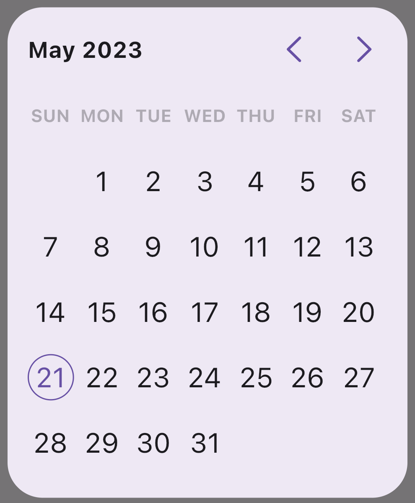
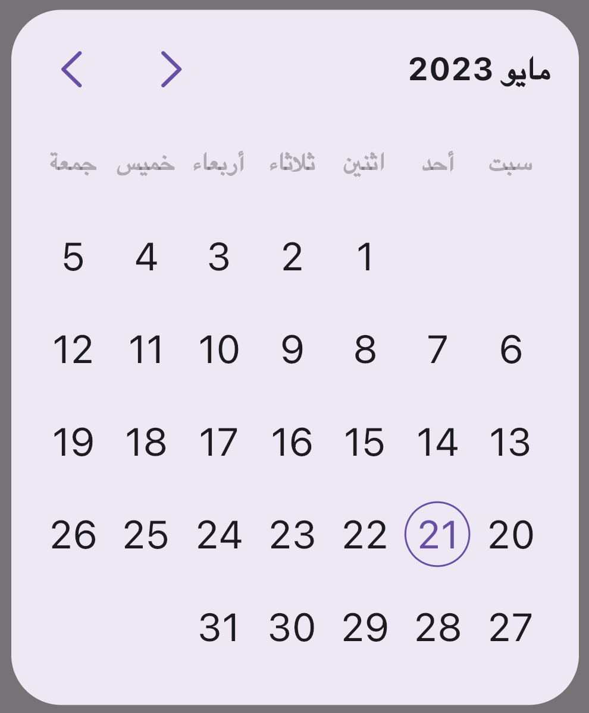
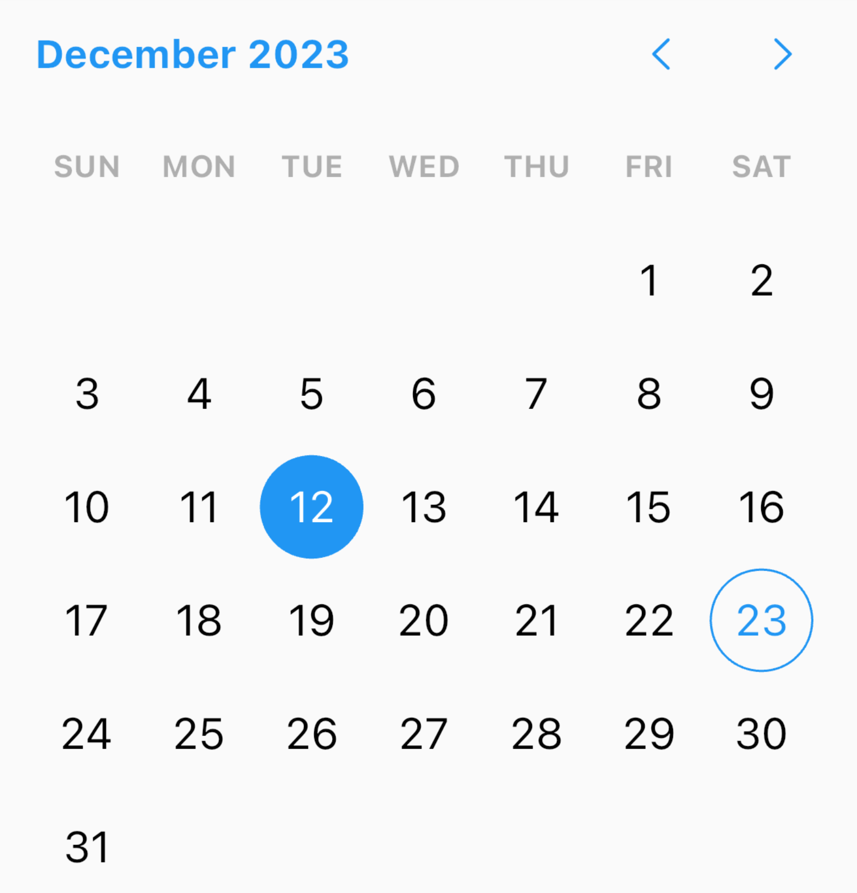
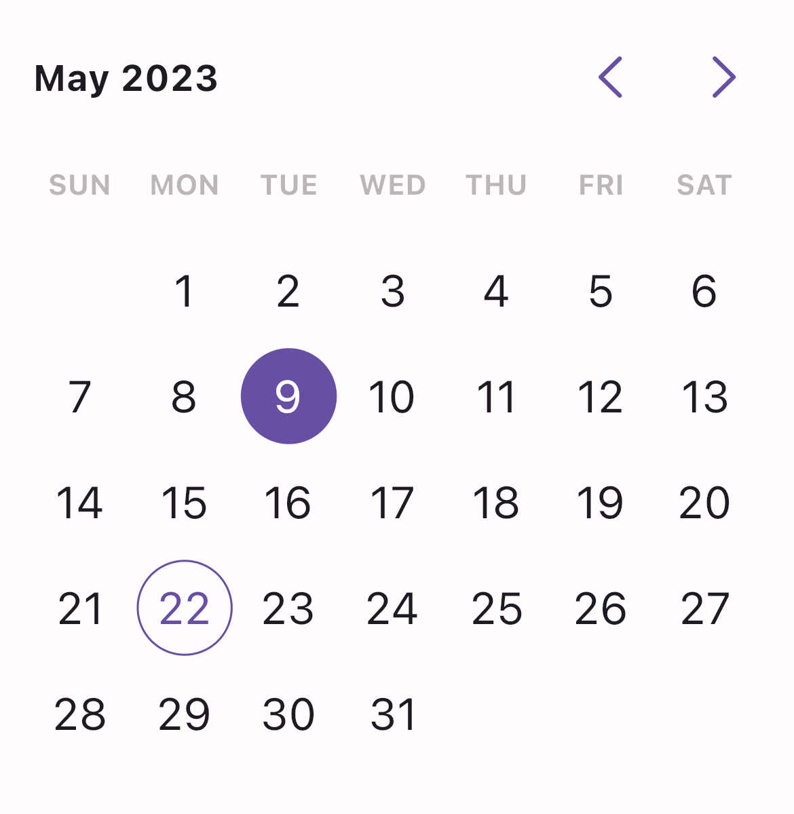

# Date Picker

A Flutter library that provides a customizable Material Design date picker widget.

<div>
  
  
  
  
</div>

## Features

- Beautiful UI.
- Support Material 3 out of the box.
- Highly Customizable UI.
- Supports multi-language.

## Usage

To use the Date Picker library, add the following dependency to your `pubspec.yaml` file:

```yaml
dependencies:
  date_picker: ^1.0.0
```

Import the library in your Dart file:

```dart
import 'package:date_picker/date_picker.dart';
```

### Show Date Picker Dialog

Call the `showDatePickerDialog` function to show a date picker dialog:

```dart
final date = await showDatePickerDialog(
  context: context,
  initialDate: DateTime.now(),
  minDate: DateTime(2021, 1, 1),
  maxDate: DateTime(2023, 12, 31),
);
```

Customize the appearance of the date picker by providing optional parameters to the `showDatePickerDialog` function.

### Use DatePicker Widget

Alternatively, you can use the `DatePicker` widget directly:

```dart
DatePicker(
  initialDate: DateTime.now(),
  minDate: DateTime(2021, 1, 1),
  maxDate: DateTime(2023, 12, 31),
  onDateChanged: (value) {
    // Handle selected date
  },
  todayTextStyle: const TextStyle(),
  daysNameTextStyle: const TextStyle(),
  enabledDaysTextStyle: const TextStyle(),
  selectedDayTextStyle: const TextStyle(),
  disbaledDaysTextStyle: const TextStyle(),
  todayDecoration: const BoxDecoration(),
  enabledDaysDecoration: const BoxDecoration(),
  selectedDayDecoration: const BoxDecoration(),
  disbaledDaysDecoration: const BoxDecoration(),
);
```

## Multi-language support

This package has multi-language supports. To enable it, add your `Locale` into the wrapping `MaterialApp`:

```dart
MaterialApp(
  localizationsDelegates: GlobalMaterialLocalizations.delegates,
  supportedLocales: const [
    Locale('en', ''),
    Locale('zh', ''),
    Locale('ru', ''),
    Locale('es', ''),
    Locale('hi', ''),
    Locale('ar', ''),
  ],
  ...
);
```

For more details, see the [example](https://github.com/hasanmhallak/date_picker/example) folder.

## Contribution

Contributions to the Date Picker library are welcome! If you find any issues or have suggestions for improvement, please create a new issue or submit a pull request on the [GitHub repository](https://github.com/hasanmhallak/date_picker).

Before creating a PR:

- Please make sure to cover any new feature with proper tests.
- Please make sure that all tests passed.
- Please always create an issue/feature before raising a PR.
- Please always create a minimum reproducible example for an issue.
- Please use the official [Dart Extension](https://marketplace.visualstudio.com/items?itemName=Dart-Code.dart-code) as your formatter or use `flutter format .` if you are not using VS Code.
- Please keep your changes to its minimum needed scope (avoid introducing unrelated changes).

## License

The Date Picker library is licensed under the [MIT License](https://opensource.org/licenses/MIT). See the [LICENSE](https://github.com/hasanmhallak/date_picker/blob/master/LICENSE) file for more details.
